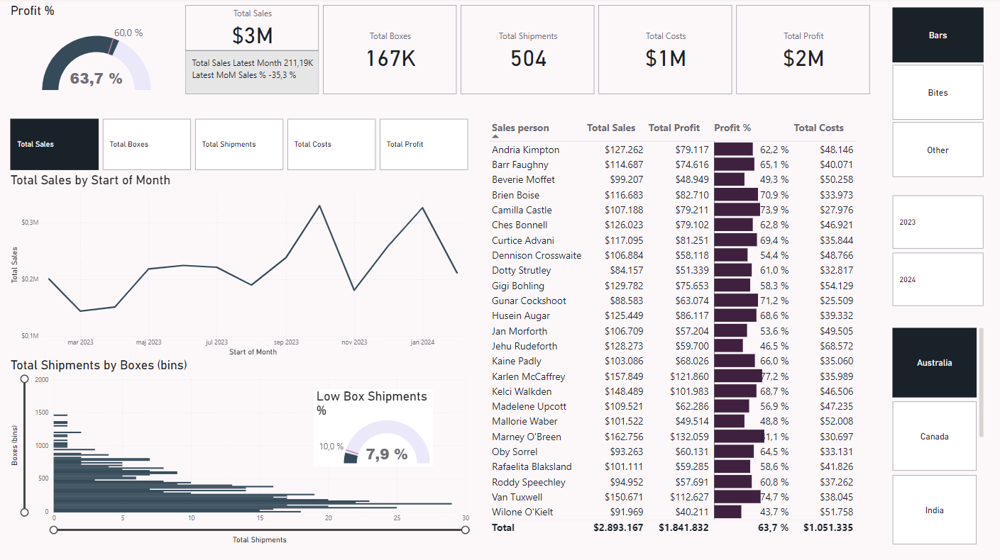

# Microsoft Power BI Sales Analysis

Sales analysis using Power BI.

### Chapters
- Data Modeling
- DAX Measuers: 
   - MoM
   - sum
   - countrows
   - related
   - latest date
   - divide
   - calculate
   - previousmonth (MoM Changes)
- Dashboard Design 

## Run Localy

Clone the project

```
https://github.com/veronikagregorec/power-bi-sales-analysis.git
```
Go to the project directory and open ```.pbix``` file with Microsoft Power BI Desktop.

## Power BI Dashboard Preview

Sales Report Page


